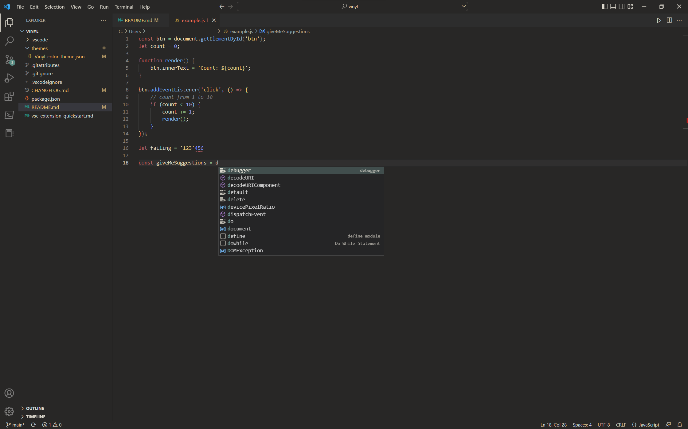

    

# Vinyl Theme

    
    
    

 

Vinyl is a soft dark theme for VSCode with a vintage feel.

The theme is provided free of charge, with absolutely no warranty.

You may reuse, repurpose and alter the code any way you like, but you may not sell it as it is or with only minor alterations.

**Enjoy!**

## Screenshot

The font used in the above screenshot is JetBrainsMono.

## Copyright

Copyright (C) 2023 Sophie Bosio

Under the GNU General Public License v3.0.
Please see dedicated LICENSE file for more details.
